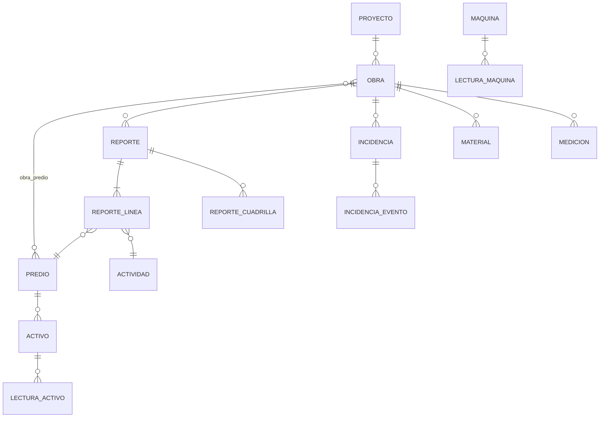

# 1 — Modelo de datos

Independiente de dónde se almacene. Si va en Odoo, cada tabla es un modelo custom; si va en base propia, es una tabla. Los nombres son de trabajo.

## Reglas que no se negocian

1. `obra_id`, `predio_id` y `proyecto_id` son identificadores estables y públicos. No se renombran ni se reciclan. Odoo, el panel y el bot usan los mismos.
2. `reporte.recibido_en`, `reporte.autor_id` y `reporte.obra_id` los escribe el sistema a partir del mensaje de Telegram. Ningún endpoint los acepta del usuario. `fecha_operativa` se deriva con una regla fija; el usuario solo la confirma cuando el bot pregunta.
3. El cultivo vive en `proyecto.tipo`. Ningún reporte lleva cultivo.
4. Toda cantidad de avance se guarda en su unidad original y normalizada a hectáreas. El panel muestra hectáreas.
5. Una incidencia no pasa a `cerrada` sin `causa_raiz`.

## Entidades

### `proyecto`
| campo | tipo | nota |
|---|---|---|
| id | id | |
| tipo | enum | maiz · papaya · ganaderia · infraestructura · reforestacion |
| ciclo | text | "Maíz 2026" |
| superficie_meta_ha | decimal | la fija Dirección; hoy no existe |
| fase_catalogo | enum | ver catálogos |
| inicio, fin | date | |

### `obra`
| campo | tipo | nota |
|---|---|---|
| id | id | |
| nombre | text | canónico |
| alias | text[] | nombres con los que aparece en el corpus |
| proyecto_id | fk | |
| entidad_id | fk entidad | tabla local de siete filas; ver `entidad` |
| fase_actual | enum | del catálogo de fases del proyecto |
| estado | enum | prospeccion · habilitacion · operacion · mantenimiento · standby · cerrada |
| tg_thread_id | int | tema de Telegram; único por obra activa |
| responsable_id | fk usuario | quien recibe el reclamo de las 21:00 |

### `predio`
| campo               | tipo     | nota                                          |
| ------------------- | -------- | --------------------------------------------- |
| id                  | id       |                                               |
| nombre, alias[]     | text     |                                               |
| poligono            | geometry | UTM 15N o WGS84; ver estado en archivo 5      |
| superficie_legal_ha | decimal  | de escritura o polígono                       |
| superficie_util_ha  | decimal  | la que se puede mecanizar                     |
| regimen             | enum     | propio · rentado · en_tramite                 |
| restricciones       | text[]   | "servidumbre CAPAE", "postes CFE"             |
| odoo_partner_id     | int      | opcional, si el dueño existe en `res.partner` |

### `reporte`
| campo | tipo | nota |
|---|---|---|
| id | id | |
| obra_id | fk | del tema, o del teclado si vino fuera de tema |
| recibido_en | timestamptz | `message.date` de Telegram; hora de llegada al servidor |
| fecha_operativa | date | día al que pertenece el trabajo. Regla en archivo 2 §6: la `Fecha:` escrita si está a ±1 día de `recibido_en`; si no, el día de `recibido_en`; entre 00:00 y 06:00 el bot pregunta |
| autor_id | fk usuario | mapeado desde `from.id` de Telegram |
| tg_chat_id, tg_message_id | int | para editar por reply |
| texto_original | text | el bloque tal cual se pegó; nunca se altera |
| nota | text | lo que quedó fuera de cabeceras |
| estado | enum | borrador · confirmado · corregido |
| adjuntos | jsonb | lista de `file_id` de Telegram con tipo |

### `reporte_linea`
| campo                 | tipo          | nota                                                               |
| --------------------- | ------------- | ------------------------------------------------------------------ |
| reporte_id, predio_id | fk            | predio obligatorio; si la obra tiene un solo predio se asigna solo |
| actividad_id          | fk            | del catálogo; `otro` si el parser no clasifica                     |
| texto                 | text          | la viñeta original                                                 |
| cantidad, unidad      | decimal, enum | m2 · ha · ml · pieza · pct                                         |
| cantidad_ha           | decimal       | normalizada; null si la unidad no es de superficie                 |
| subzona               | text          | libre                                                              |
| fuente                | enum          | campo · dron · topografia                                          |

### `reporte_cuadrilla`
| campo | tipo |
|---|---|
| reporte_id | fk |
| rol_id | fk catálogo |
| headcount | int |

### `maquina`, `lectura_maquina`
| campo | tipo | nota |
|---|---|---|
| maquina.id, nombre, tipo | | tractor · bulldozer · retroexcavadora · dron · sembradora · rastra |
| maquina.propietaria_id, operadora_id | fk entidad | hoy Aspromex presta a Agrokool |
| maquina.umbral_servicio_hrs | decimal | 300 para el Puma |
| maquina.odoo_fleet_id | int | si se adopta `fleet.vehicle` |
| lectura.fecha, autor_id, obra_id | | |
| lectura.horometro_inicio, horometro_fin, litros | decimal | |
| lectura.foto_file_id | text | |

### `activo`, `lectura_activo`
Bomba, veleta, pozo, cerco, cisterna, riego. `activo.predio_id`, `tipo`, `umbral_dias_sin_lectura` (30). `lectura.estado` enum ok · alerta · falla, `nota`, `fecha`, `autor_id`.

### `incidencia`, `incidencia_evento`
| campo | tipo | nota |
|---|---|---|
| incidencia.folio | text | `F-14`, secuencial |
| incidencia.tipo | enum | catálogo |
| incidencia.obra_id, maquina_id, activo_id | fk | los que apliquen |
| incidencia.estado | enum | abierta · diagnostico · reparacion · verificacion · cerrada |
| incidencia.abierta_en, cerrada_en | timestamptz | |
| incidencia.causa_raiz | text | obligatoria para `cerrada` |
| evento.fecha, autor_id, texto, foto_file_id, estado_resultante | | cada reply al mensaje del bot es un evento |

### `material`
| campo | tipo |
|---|---|
| obra_id, insumo | fk, text |
| requerido, en_sitio, pedido | decimal |
| unidad | text |
| eta | date, null |
| odoo_po_id | int, null |
| actualizado_en, autor_id | |

### `medicion`
`obra_id`, `predio_id`, `fecha`, `hectareas`, `fuente` (dron · topografia), `archivo_file_id`, `autor_id`. Cuando existe, es la cifra oficial de avance de esa obra/predio a esa fecha; las líneas de reporte con `fuente = campo` se conservan y se muestran al lado.

### `usuario`
`id`, `nombre`, `tg_user_id`, `rol` (campo · supervisor · gerencia · direccion · it), `odoo_user_id` opcional, `puede_cerrar_incidencias` bool, `puede_registrar_medicion` bool.

### `entidad`
Siete filas, semilla: ITZ, McClick, Aspromex, Balam, Aquario Transportes, AQR Services, Agrokool. `id`, `nombre`, `odoo_company_id` (opcional; hoy 1, 2, 3, 4, 5, 6, 7 en `itz_erp1`). Es la única tabla que existe para no depender de Odoo como catálogo.

## Qué apunta a Odoo y qué obliga

El modelo no decide dónde vive el dato. Cinco campos hacen referencia a Odoo; ninguno es obligatorio:

| Campo | Apunta a | Obliga |
|---|---|---|
| `entidad.odoo_company_id` | `res.company` | No. Sin él, la tabla local sigue funcionando |
| `predio.odoo_partner_id` | `res.partner` | No, nullable |
| `maquina.odoo_fleet_id` | `fleet.vehicle` | No; solo si se adopta `fleet` |
| `material.odoo_po_id` | `purchase.order` | No; solo si las compras de AGROK entran a Odoo |
| `usuario.odoo_user_id` | `res.users` | No, nullable |

Lo que sí obligaría a Odoo es una decisión posterior y ajena al modelo: si el dato operativo debe casarse con el financiero (archivo 3, sección 2). Este modelo está diseñado para que esa decisión se pueda tomar en cualquiera de los dos sentidos sin rehacer nada.

## Catálogos semilla

**actividad**: desmonte · despalme · destronque · desenraizado · quema · guardaraya · rastreo_1 · rastreo_2 · nivelacion · terraceo · posteo · cercado · siembra · fertilizacion · fumigacion · monitoreo · chapeo · acarreo · mantenimiento_maquinaria · limpieza · obra_civil · otro

**rol**: operador_bulldozer · operador_retro · operador_tractor · lider_posteo · tecnico · auxiliar · encargada

**tipo_incidencia**: falla_mecanica · fuego · clima · plaga · conflicto_terceros · personal · seguridad_epp · desabasto_material

**motivo_sin_actividad**: lluvia · sin_material · sin_cuadrilla · sin_maquina · descanso

**fase maíz**: V0_V2 · V3_V8 · V9_VT · R1_R4 · R5_R6 · cosecha (de los `.mpp`)
**fase papaya**: preparacion · establecimiento · manejo_1 · manejo_2 · cosecha

## Normalización de unidades

| unidad | a hectáreas |
|---|---|
| ha | ×1 |
| m2 | ÷10,000 |
| ml | null (se guarda, no se suma a superficie) |
| pct | null salvo que la obra tenga `superficie_meta_ha`; entonces pct × meta |

## Relacionado
[[0 — Léeme]] · [[2 — Telegram]] · [[3 — Backend y escritorio]]
