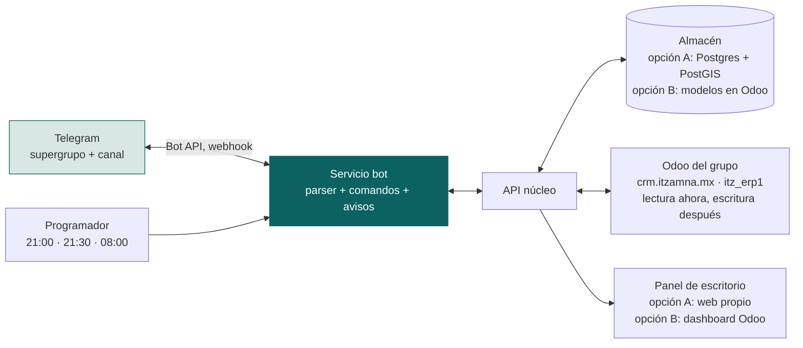

# 3 — Backend y escritorio

## 1. Componentes

El bot y la API son el mismo patrón que la app intermedia de Aquario (TESA). Lo que este caso añade: temas por obra, parser del reporte, y avisos programados.

## 2. Dónde vive el dato: las dos opciones y lo que no cambia

| | A · Base propia | B · Modelos custom en Odoo |
|---|---|---|
| Almacén | Postgres + PostGIS | `agk.*` en `itz_erp1`, compañía 7 |
| Adjuntos | `file_id` de Telegram; descarga bajo demanda a almacén de objetos | `ir.attachment` (volumen alto: 3 a 18 por reporte) |
| Polígonos | PostGIS nativo | sin geo nativa; texto o módulo OCA |
| Permisos | propios, por `usuario.rol` | record rules por compañía, ya existen |
| Radio de impacto | aislado | mismo proceso que ITZ, McClick y Balam en producción |
| Costeo futuro | por conector | nativo |

**Contrato que se cumple en las dos opciones:**

1. Los ids de `obra`, `predio`, `proyecto` son los del archivo 1 y se exponen por API. Si se elige A, Odoo los adopta como `x_agk_obra_id` donde haga falta. Si se elige B, son los `id` de los modelos.
2. `entidad` es una tabla local de siete filas con `odoo_company_id` opcional. Odoo no es la autoridad del catálogo de empresas; se le referencia.
3. La API expone un evento por reporte confirmado con `obra_id`, `predio_id`, `fecha`, líneas y cuadrilla. Es lo que un día alimenta costo por hectárea; se define ahora aunque nadie lo consuma todavía.
4. El servicio nunca escribe una aprobación. Lee.

Recomendación: A para el piloto, con el contrato de arriba desde el día uno. Si B resulta preferible, migrar 2 semanas de datos de piloto es trivial.

## 3. Conector Odoo

Verificado el 28 de agosto: XML-RPC con la cuenta de Luis da lectura completa.

| Uso | Modelo | Cuándo |
|---|---|---|
| Lista de entidades | `res.company` | v1, lectura |
| Aprobaciones pendientes | `purchase.order` con `x_pending_approval_by` y estados de `purchase_tier_validation` | v1 lectura, **solo si Aspromex y Agrokool entran al flujo de Odoo**; hoy tienen 0 órdenes. Si el canal sigue siendo Teams, este conector no se construye |
| Material pedido y fecha | `purchase.order.line` | igual que arriba |
| Maestro de máquinas y horómetro | `fleet.vehicle`, `fleet.vehicle.odometer`, `fleet.vehicle.log.services` | v2. `fleet` está instalado y vacío; trae odómetro y servicio nativos. Si se adopta, `lectura_maquina` se escribe ahí y el aviso de servicio sale del módulo |
| Socios (proveedores, dueños de predio) | `res.partner` | v2, lectura |
| Costo por obra | plan analítico o `x_agk_obra_id` en compras | v3, escritura; requiere decisión de Finanzas |

Credenciales por variable de entorno; cuenta técnica propia con permisos de lectura, no la de Luis.

## 4. API mínima

| Método | Ruta | Uso |
|---|---|---|
| POST | `/reportes` | desde el bot; cuerpo = reporte parseado; responde ids |
| PATCH | `/reportes/{id}` | corrección por reply |
| POST | `/incidencias`, `/incidencias/{folio}/eventos`, `/incidencias/{folio}/estado` | |
| POST | `/lecturas/maquina`, `/lecturas/activo`, `/material`, `/mediciones` | |
| GET | `/obras`, `/obras/{id}/avance`, `/obras/{id}/material` | bot y panel |
| GET | `/tablero/hoy` | el mismo JSON alimenta el mensaje fijado y el panel |
| GET | `/incidencias?estado=abierta` | |
| GET | `/predios/{id}/geometria` | GeoJSON, panel |
| GET | `/eventos/reportes?desde=` | el contrato hacia costeo |

## 5. Panel de escritorio v1

Cuatro widgets, los mismos que el mensaje fijado. Definiciones exactas:

| Widget | Cálculo |
|---|---|
| **Obras sin reporte** | Obras con `estado = operacion` y sin `reporte` (confirmado o sin_actividad) en el día; ordenadas por días desde el último. Días hábiles |
| **Avance contra meta** | Por obra y predio: `Σ reporte_linea.cantidad_ha` donde `fuente = campo` · última `medicion.hectareas` · `proyecto.superficie_meta_ha` · falta = meta − oficial. Oficial = medición si existe, si no campo |
| **Incidencias abiertas** | `estado ≠ cerrada`, con `hoy − abierta_en`, ordenadas por días |
| **Bloqueado por material** | `material` con `requerido − en_sitio > 0`, mostrando `pedido` y `eta`; bandera si `eta` es null o vencida |

v2: horómetro y servicio por máquina; estimación de campo contra medición por obra; activos sin lectura.
v3: mapa. Geometría lista para 13 de 17 predios en `predios_coordenadas.csv` (UTM 15N; San Pedro y Guayeme en KMZ). Precedente en `dashboard_clima.html`. Pendientes de curar antes de dibujar: Santa Teresita (tres polígonos, 518/521/558 ha; probable alias de La Magdalena), Rach p1 (2 vértices), Arceo (1 o 2 polígonos), ASPROMEX (copia de San Alberto).

Si el panel se hace en Odoo (opción B), los cuatro widgets son vistas sobre los modelos `agk.*`; el mensaje fijado del Tablero se genera igual desde `/tablero/hoy`.

## 6. Operación

- Webhook de Telegram con secreto; reintentos idempotentes por `tg_message_id`.
- Logs de parser: cada línea `otro` y cada avance sin predio resuelto se cuentan; es la métrica de calidad del catálogo durante el piloto.
- Respaldo diario del almacén; los adjuntos viven en Telegram hasta que se descargan.
- Un solo despliegue para Aquario y AGROK si el bot es el mismo; separación por `chat_id`.

## Relacionado
[[0 — Léeme]] · [[1 — Modelo de datos]] · [[2 — Telegram]] · [[4 — Plan y responsables]] · [[7.0 — Estado de la instancia leído por API 2026-08-28]]
